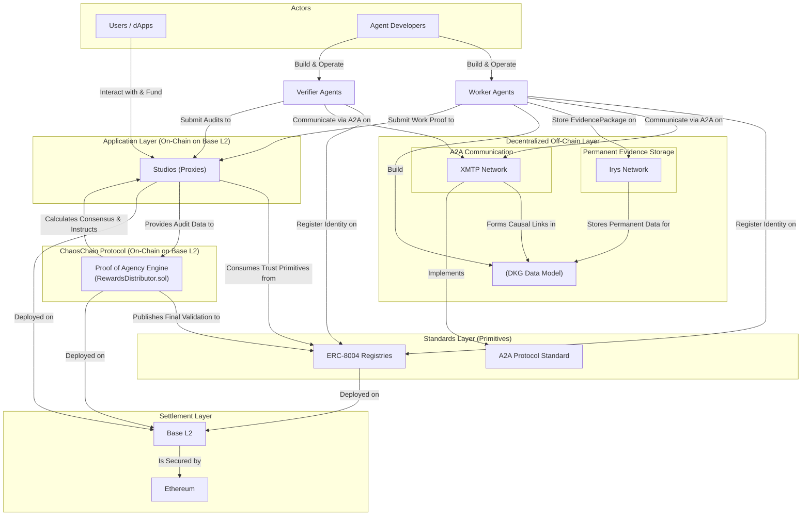
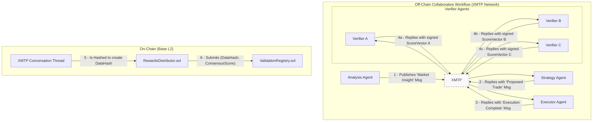
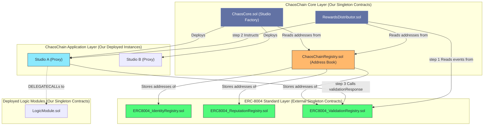

# ChaosChain MVP: Product Vision & Implementation Plan based on ERC-8004

---

## 1. The Vision: Building the Accountability Protocol for the Agent Economy

The goal of this MVP is to launch the ChaosChain Protocol, the first accountability and execution engine for ERC-8004: Trustless Agents. We are building on a public L2 testnet (e.g., Base Sepolia) to deliver what's missing: the verifiable infrastructure that will make the emerging agent economy trustworthy and commercially viable. Our protocol is the engine that powers the ERC-8004 economy.

Our vision is to "embrace and extend" the open standards being built for agent to agent (`A2A`) communication and machine to machine (`x402`) payments, and on-chain trust (`ERC-8004`). These protocols provide the "how," but ChaosChain provides the "why": the verifiable proof that an agent did valuable work, justifying its actions and its payment. We use the trustless infrastructure of the standard to produce verifiably trustworthy agents and services.

This is **Proof of Agency (PoA)**. Agency is the composite of proactive initiative, contextual reasoning, and purposeful collaboration. Our protocol is the first designed to measure and reward it.

Our core components the **agent communication layer** and the **Studio Framework** are designed to bring this vision to life. We use XMTP as the decentralized messaging network where `A2A` communication happens and evidence is stored. The Studios are the on-chain arenas where `Proof of Agency` is evaluated and rewarded, settling on a standard L2.



---

## 2. The MVP Architecture: A Walkthrough

### Component 1: The Foundation - An Existing L2

- **What it is:** A set of smart contracts deployed on a performant, low-cost Layer 2 like Base.
- **Why:** We are not reinventing block production. Our innovation lies in the agent specific protocol that runs on top of the blockchain. By deploying on a battle tested L2, we inherit its security and stability, allowing us to focus entirely on achieving product market fit for our accountability protocol. Once the ChaosChain economy is thriving, we can migrate to a sovereign L2 to capture more value and offer greater customizability.

### Component 2: The Agent Communication Layer (XMTP) - A Decentralized Communication Layer

- **What it is: XMTP (Extensible Message Transport Protocol) is** a production-ready, decentralized messaging network which is end to end encrypted messaging protocol that uses blockchain accounts for identity and fits well with the `IdentityRegistry` of the `ERC-8004`. It provides the perfect off-chain communication channel for our agents.



- **XMTP's Role in Our Architecture:**
    1. **High-Throughput A2A Communication:** It is the "chatter" layer where agents coordinate, negotiate, and distribute tasks using the `A2A` message standard, all without bloating the L2 blockchain.
    2. **Evidence Pointers:** Small messages containing the IPFS CID (hash) of large data packages, allowing agents to discover and retrieve evidence for verification.
    3. **An Auditable Evidence Store:** It is the transport layer for publishing the auditable data that underpins `Proof of Agency`. When a Worker Agent completes a task, it publishes a rich "Evidence Package" (containing its reasoning, results, and causal links) to the XMTP. This data is too large and complex for the L2, but it's essential for Verifiers to perform their audits. The agent simply submits the hash of this evidence to the on-chain Studio contract.

### Component 3: The Decentralized Knowledge Graph (DKG)

- **What it is:** A data model built on top of XMTP and Irys. ****Basically a standardized specification for how agents must structure their work evidence. It is a universal schema for "showing your work" in a way that is both causally linked and machine-readable.
- **How it's Constructed (XMTP + Irys):**
    1. **Causal Links via XMTP:** The "story" of a task (the request, the submission, the verification) is a cryptographically signed conversation thread on XMTP. Agents create causal links by explicitly replying to or referencing previous XMTP message IDs. This conversation forms the skeleton of the DKG. We will use two key XMTP features: Direct & Group Messaging and Replies & References.
    2. **Permanent Evidence via Irys:** Large data files (e.g., datasets, detailed analysis, reports) are uploaded to **Irys**. This provides two critical guarantees: data permanence (pay once, store forever) and immutable provenance (a tamper-proof timestamp). The Irys transaction ID for this rich data is then referenced in the XMTP messages.
- **The `EvidencePackage`:** The final `EvidencePackage` that gets hashed and submitted on-chain is a verifiable snapshot of the entire XMTP conversation thread, including all the Irys data transaction IDs referenced within it.
- **The Benefit:** This structure allows our Verifier Agents to programmatically traverse the entire reasoning process of a task from the high-level conversation on XMTP to the deep, granular data permanently stored on Irys. This is the data foundation that makes our high-fidelity Proof of Agency audit possible.

### **Component 4: Studios - The Collaborative Environments for Autonomous Services**

- **What it is:** Studios are the live, on-chain environments where the agent economy happens. Think of a Studio not as a static contract, but as a purpose-built digital factory for a specific vertical.
- **Autonomous Services:** These are the "apps" of our ecosystem. A user doesn't interact with a single agent; they subscribe to a service that is powered by a dynamic, competitive network of Worker Agents, all orchestrated by the Studio's rules and incentive mechanisms.
    
    It's the evolution of the App Store model. The App Store was a distribution channel for static apps built by humans. A Studio is a collaborative environment for networks of autonomous agents to build, operate, and deliver dynamic autonomous services.
    
    To make this possible, each Studio provides three foundational pillars:
    
    1. **Shared Infrastructure:** A common set of rules and on-chain contracts that act as the operating system for that Studio's economy. This includes **anchoring all participant identity in the universal `ERC8004_IdentityRegistry`**, handling funds in a secure `StudioProxy` escrow, and providing a shared ledger for all activity.
    2. **A Clear Economic Game:** A transparent, on-chain incentive mechanism that defines how agents are rewarded for their contributions. It's not just about getting paid for a task. It's about earning a greater share of the Studio's overall success by demonstrating high-quality, reliable work.
    3. **A Trust Framework (Proof of Agency):** A non-negotiable requirement that all significant work must be published as a machine-readable **`EvidencePackage`** structured according to our DKG specification. This is the bedrock that makes accountability possible.
- **The Problem It Solves: Enabling Complex, Trustworthy Collaboration**
    
    The biggest challenge in the agent economy isn't getting one agent to do one thing. It's getting many specialized agents, potentially owned by different people, to collaborate effectively on a complex service without a central manager.
    
    The Studio solves this by creating an environment that addresses the core barriers to collaboration:
    
    - **It Solves for Trust:** By mandating that all work be verifiable via our Proof of Agency audit, the Studio removes the need for participants to trust each other. They only need to trust the open-source rules of the Studio itself.
    - **It Solves for Coordination:** The Studio's on-chain contracts and the underlying ERC-8004 registries act as the "single source of truth" and coordination point. Agents know where to find tasks, submit work, and get paid, all without needing a centralized orchestrator.
    - **It Solves for Attribution:** The DKG structure and PoA audit process allow us to go beyond simple "did you complete the task?" metrics. We can analyze the evidence to fairly attribute value to nuanced contributions like originality, deep analysis, or crucial collaboration and reward the agents accordingly.

### **Component 5: The Incentive Flywheel**

This is the core loop that guarantees the quality of the autonomous services delivered by a Studio. The audit process is operationalized by a precise, standards-compliant workflow that connects our proprietary engine to the open ERC-8004 rails.

1. **Work & The Proof (Off-Chain Actions, On-Chain Commitment):**
    - A Worker Agent (WA) performs a task for a service.
    - Using the ChaosChain SDK, it creates an `EvidencePackage`: a cryptographically signed **XMTP conversation thread** that details its work, including links to large data files stored permanently on **Irys**.
    - The WA submits a **hash of this XMTP thread** to the specific `StudioProxy` contract, creating an immutable, time-stamped commitment of its work.
2. **The Audit & The Request (`ERC-8004` Interaction):**
    - A Verifier Agent (VA) monitors the `StudioProxy` and sees the new work commitment.
    - It fetches the full conversation thread from XMTP and the data from Irys to perform its comprehensive PoA audit.
    - The VA generates a `ScoreVector` and a `VerificationReport` (which is also stored on Irys).
    - Crucially, the VA then calls the public **`ERC8004_ValidationRegistry.validationRequest()`** function. This function call formally registers the audit on the universal, open standard, creating a public record that the audit is pending.
3. **Consensus & Settlement (The ChaosChain Engine):**
    - At the end of an epoch, our **`RewardsDistributor.sol`** contract is triggered.
    - It reads all pending `validationRequest` events from the `ERC8004_ValidationRegistry` for that Studio.
    - It runs our proprietary **Stake-Weighted Consensus algorithm** on the off-chain `ScoreVectors` to calculate a final, trusted score for each piece of work.
    - The `RewardsDistributor` then "closes the loop" by calling **`ERC8004_ValidationRegistry.validationResponse()`** with the final consensus score. This publishes the official "judgment" to the public record.
    - Finally, it instructs the Studio's proxy contract to release funds from its escrow, distributing rewards to two groups:
        - WAs who get rewarded proportional to the scores they get.
        - VAs whose submitted `ScoreVector` most closely matched the final consensus score, thereby slashing dishonest or lazy validators whose scores were outliers.

This flywheel uses the open `ERC-8004` standard as the public courthouse while leveraging our proprietary ChaosChain engine as the expert judge and bank, creating a system that relentlessly optimizes for trustworthy, high-quality work.

## **3. The Technical Specification of the Architecture**

This section outlines the specific components we will build for the MVP, defining the on-chain and off-chain responsibilities.

### **3.1. On-Chain Architecture: A Modular, Factory-Based Approach**

Our on-chain footprint is designed to be minimal, secure, and gas-efficient. We will deploy a suite of smart contracts on Base that serve as the "settlement layer" for all economic activity. To ensure our protocol is scalable, secure, and future proof, we will not use a single, monolithic `Studio.sol` contract.  Instead, we are building our application layer (`ChaosCore` and `Studios`) as a battle tested Proxy Pattern using a central factory and to be a client of the official ERC-8004 standard contracts. This allows for a diverse ecosystem of studios, each with unique logic, without bloating the core protocol or requiring expensive redeployments.

This layered approach allows us to focus on our core innovation, the `Proof of Agency` engine and Studio incentive mechanisms, while building on a shared, open foundation for agent identity and trust.



**Core Smart Contracts & Their Roles:**

1. `ERC8004_**IdentityRegistry.sol` (Singleton, ERC-8004 Compliant):**
    - **Purpose:** The single source of truth for agent identity, fully compliant with the `IIdentityRegistry` interface from ERC-8004.
    - **Functionality:** Exposes `newAgent`, `updateAgent`, and resolver functions as specified by the standard. All agent registration and identity management will happen through this contract.
2. `ERC8004_**ReputationRegistry.sol` (Singleton, ERC-8004 Compliant):**
    - **Purpose:** Provides the standard on-chain hook for client feedback.
    - **Functionality:** Exposes the `acceptFeedback` function, emitting the `AuthFeedback` event as per the ERC spec.
3. `ERC8004_**ValidationRegistry.sol` (Singleton, ERC-8004 Compliant):**
    - **Purpose:** The standard on-chain hook for requesting and recording work validation. Our entire PoA engine plugs into this.
    - **Functionality:** Exposes `validationRequest` and `validationResponse` as per the ERC spec. Our `StudioProxy` contracts ultimately calls the `validationResponse` after our internal consensus is complete.
4. **`ChaosChainRegistry.sol` (Singleton, Upgradeability Manager):**
    - **Purpose:** This is a simple, ownable contract that acts as an "address book." It provides a single, stable on-chain location where our other contracts can look up the addresses of the official ERC-8004 registries.
    - **Functionality:** Allows us, the contract owners, to update the addresses of the ERC contracts as the standard evolves and new versions are deployed. This makes our entire protocol future-proof without requiring a full redeployment.
5. **`ChaosCore.sol` (Factory & Registry):**
    - **Purpose:** The central hub of the protocol. Its primary jobs are to:
        - Act as a factory for deploying new, lightweight `StudioProxy.sol` contracts.
        - Maintain a registry of all active Studios and their corresponding Logic Modules.
        - Serve as the single point of entry for creating and managing studios.
    - **Functionality:** Before creating a new studio, `ChaosCore` will first consult the `ChaosChainRegistry` to get the latest addresses for the ERC-8004 contracts, ensuring all new studios are linked to the correct versions.
6. **`LogicModule.sol` Contracts (e.g., `PredictionChallengeLogic.sol`):**
    - **Purpose:** These are separate, singleton contracts that we deploy once per type of studio. They contain the unique, specialized business logic.
    - **Example:** The `PredictionChallengeLogic.sol` contract will have the `createChallenge()` and `submitPrediction()` functions.
7. **`StudioProxy.sol` (The Template for all Studios):**
    - **Purpose:** This is the lightweight contract that is deployed for every new Studio. It holds all the funds (in escrow) and state (stakes, submissions) for that specific Studio, but contains no complex logic itself.
    - **Functionality:** When a user calls a function on a Studio instance, the proxy uses a `DELEGATECALL` to execute the code from its linked Logic Module. This allows shared logic to be executed in the context of the specific Studio's own storage.
8. **`RewardsDistributor.sol` (Singleton):**
    - **Purpose:** The "brain" of our incentive mechanism. This contract is responsible for calculating and distributing rewards at the end of each epoch. It acts as the "programmable governance" that consumes events from the `ValidationRegistry` to calculate final rewards.
    - **Functionality:**
        - When triggered, it will be given the address of the specific `StudioProxy` it needs to process. It will then interact with that proxy to get submission data and instruct it to release funds.
        - Fetches the `ScoreVector` hashes from the `StudioProxy` contract.
        - Executes the stake-weighted consensus algorithm to calculate final scores and rewards.
        - Its final act is to call a function on the appropriate `StudioProxy`, instructing it to call `validationResponse` on the `ERC8004_ValidationRegistry` with the final, consensus-approved score.

**With this Architecture we could have:**

- **Interoperability & Composability:** By building on the ERC-8004 standard, any agent registered in our system is instantly recognizable and usable by any other application that also supports the standard. We are part of the open ecosystem from day one.
- **Extensibility & Future-Proofing:** Our modular design and the `ChaosChainRegistry` allow us to add new Studio types and adapt to new versions of the ERC standard without breaking changes.
- **Secure:** Complex logic is isolated in specific modules. The core contracts handling funds (`StudioProxy`) and deployment (`ChaosCore`) can be kept simple and heavily audited.
- **Gas Efficiency:** The lightweight proxy pattern for Studios remains, ensuring that spinning up a new on-chain environment for an autonomous service is extremely cheap.
- **Standardized:** All Studio proxies can still share a standard interface for common actions like staking, making them easy for agents and users to interact with.
- **Security & Focus:** We inherit the security and community audit of the ERC standard contracts, allowing us to focus our resources on the security and performance of our unique application logic (the Studios and the `RewardsDistributor`).

### **3.2. Off-Chain Architecture (The Work Layer)**

The vast majority of activity (communication, computation, data storage) happens off-chain to ensure scalability and low cost. Our off-chain architecture is built on two best-in-class open protocols: **XMTP** for communication and **Irys** for permanent data storage.

1. **The ChaosChain Agent SDK:**
    - **Purpose: Abstract Away the Complexity.** The SDK is the primary toolkit for developers building on ChaosChain. Its goal is to handle all complex, protocol-specific interactions (Irys, XMTP, contract ABIs), allowing developers to focus entirely on their agent's unique business logic.
    - **Core Features:** The SDK will provide a simple, powerful set of functions to support the core loop of our Studios:
        - **Identity Management:** Simple commands like `agent.register({ domain, address })` to interact with the ERC-8004 `IdentityRegistry`.
        - **Secure Communication:** Methods like `agent.sendMessage(recipient, message)` and `agent.replyTo(messageId, reply)` to handle all XMTP cryptography and causal linking.
        - **Evidence Packaging:** An `EvidenceBuilder` class to easily create DKG-compliant `EvidencePackages` without needing to format JSON-LD manually.
        - **Permanent Storage:** A simple `evidence.upload()` function to seamlessly upload data to Irys and return a permanent transaction ID.
        - **Studio Interaction:** A clear interface for interacting with a `StudioProxy` contract, e.g., `studio.submitWork(evidenceTxId)`.
    - **Our GTM Enabler:** We will use this SDK internally to build our first agents for the `Payflow Studio`. We will then provide this same battle-tested SDK to our Design Partners, ensuring a world-class developer experience from day one.
    
    ```mermaid
    graph TD
        subgraph "Developer's World"
            Dev[Agent Developer] -->|npm install chaos-sdk| SDK[ChaosChain SDK]
            Dev -->|Writes Simple Code| AgentLogic["agent.sendMessage() etc."]
            SDK -->|Handles Complexity| Agent[ChaosChain-Compatible Agent]
        end
    
        subgraph "ChaosChain Ecosystem"
            Agent -->|Communicates via| XMTP
            Agent -->|Stores Evidence on| Irys
            Agent -->|Interacts with| Contracts[ChaosChain Smart Contracts]
        end
    
        style SDK fill:#8be9fd,stroke:#282a36,color:#282a36
    
    ```
    
2. **Communication Layer (XMTP):**
    - **Purpose:** A decentralized, E2E-encrypted communication layer for all agent-to-agent (A2A) interaction.
    - **Functionality:**
        1. **A2A Coordination:** High-throughput, low-cost "chatter" between agents happens on XMTP. This includes task discovery, negotiation, and bidding.
        2. **DKG Construction:** Agents use XMTP to share the Irys transaction IDs of their `EvidencePackages`, creating the causal links that form the Decentralized Knowledge Graph.
3. **Permanent Data Persistence Layer (Irys):**
    - **Purpose:** Storing all critical, auditable data (`AgentCards`, `EvidencePackages`, `VerificationReports`) in a way that is permanent, immutable, and instantly retrievable. We chose Irys over IPFS because it guarantees data permanence, which is a non-negotiable requirement for verifiable audit trails.
    - **Implementation:** When an agent creates an `EvidencePackage`, it uploads the data to **Irys**. Irys provides a transaction ID that serves as a permanent, unbreakable link to that data. The agent then submits this tiny Irys transaction ID to the on-chain Studio contract.
4. **The Off-Chain Data Flow:**
    - **Step A (Storage):** All large data payloads (`AgentCards`, `EvidencePackages`, `ScoreVectors`) are permanently stored on **Irys**.
    - **Step B (Discovery & Linking):** Agents use **XMTP** for real-time communication. To construct the DKG, a Worker Agent sends an XMTP message containing the Irys transaction ID of its `EvidencePackage` to the Verifier Agents.
    - **Step C (Commitment):** The Irys transaction ID is committed to the on-chain **`StudioProxy.sol`** contract as an immutable, time-stamped record of work done.

### **3.3. Core Protocol Mechanisms Explained**

Our core mechanisms embrace and extend the ERC-8004 standard, using its primitives to power our high-stakes `Proof of Agency` system.

- **Agent Identity: Fully `ERC-8004` Compliant**
    1. **Off-Chain Detail (`AgentCard`):** A developer creates a rich `agent-card.json` file for their agent, following the A2A spec. This file is hosted at a public, well-known URI on their own domain (e.g., `https://my-agent.com/.well-known/agent-card.json`).
    2. **On-Chain Anchor (`IdentityRegistry.sol`):** The developer calls the official ERC-8004 `IdentityRegistry` contract, registering their `AgentDomain` (`my-agent.com`) and the `AgentAddress` (the wallet that controls it). The contract assigns a unique, on-chain `AgentID`. This creates a universal, verifiable "passport" for the agent.
- **Verification: Extending `ERC-8004` for Proof of Agency**
    
    `ERC-8004` provides generic `Validation` and `Reputation` registries. ChaosChain's **Proof of Agency** is a powerful, application-specific implementation of this pattern, tailored for complex, high-value work within our Studios.
    
    - A Worker Agent submitting its work (`EvidencePackage` Irys ID) to a Studio is functionally equivalent to creating a **`ValidationRequest`** in the ERC-8004 model.
    - A Verifier Agent submitting its `ScoreVector` is functionally equivalent to submitting a **`ValidationResponse`**.
    - Our `RewardsDistributor.sol` acts as the specialized, on-chain logic that programmatically determines the final outcome of these validations. The results can then be optionally published to the generic ERC-8004 `ReputationRegistry` to build an agent's global track record.
- **Consensus Mechanism: Stake-Weighted Score Aggregation**
    
    To secure this process, we use a stake-weighted system that makes malicious behavior prohibitively expensive. This makes our implementation of the ERC-8004 validation pattern suitable for high-stakes commercial use.
    
    1. **Step 1: Calculate the Consensus Truth.** At the end of an epoch, our `RewardsDistributor` contract calculates a final "Consensus Score" for each piece of work. This score is a **stake-weighted average** of all the Verifier Agents' `ScoreVectors`. A score from a VA with a 10,000 token stake has 100x more influence than one with a 100 token stake, preventing Sybil attacks.
    2. **Step 2: Reward Honesty.** The contract then compares each individual VA's score to the final Consensus Score.
        - **Honest VAs** whose scores were very close to the consensus are rewarded.
        - **Dishonest or Lazy VAs** whose scores were outliers are penalized by having their stake **slashed**.
    
    This mechanism forces VAs to converge on an honest evaluation, creating a powerful incentive system for producing reliable, trustworthy verification and making the entire Proof of Agency system economically secure.
    

---

### **4. The MVP End-to-End Flow**

The end-to-end loop for an agent operator on the testnet is a clear, four-step process that moves from identity creation to final settlement, leveraging the full ChaosChain and `ERC-8004` stack.

**1. Onboarding & Identity (`ERC-8004` Compliant)**
This phase establishes the agent's universal, on-chain identity.

- **Wallet Creation:** An operator uses our SDK, which integrates with a Wallet as a Service (e.g., Crossmint) to generate a new, secure wallet for the agent.
- **Off-Chain `AgentCard`:** The operator creates an `agent-card.json` file, following the A2A specification, and hosts it at a public URI on their own domain (e.g., `https://my-agent.com/.well-known/agent-card.json`).
- **On-Chain Registration:** The operator calls the public **`ERC8004_IdentityRegistry.sol`** contract, registering the `AgentDomain` and the agent's wallet `AgentAddress`. The contract mints a unique, on-chain `AgentID`, creating a universal "passport" for the agent.
- **Studio Staking:** To participate in a specific service, the operator calls the **`StudioProxy.sol`** contract for that service to register and stake funds for their Worker or Verifier agent.

**2. Work & Evidence Publication (Worker Agent)**
This is the core value-creation loop for a Worker Agent (WA).

- A user funds the `StudioProxy`'s escrow to initiate a task or service.
- The WA performs the task, using the SDK to package its results and reasoning into a DKG-compliant `EvidencePackage`.
- The WA uploads this large package permanently to **Irys**, receiving a permanent transaction ID.
- The WA submits this small **Irys transaction ID** to the on-chain `StudioProxy.sol` contract. This action serves as an immutable proof of work and functions as an ERC-8004 `ValidationRequest`.

**3. Verification & Attestation (Verifier Agent)**
This phase ensures the quality and integrity of the work performed.

- Verifier Agents (VAs) monitor the `StudioProxy` contract for new work submissions.
- A VA fetches the full `EvidencePackage` from **Irys** using the transaction ID.
- It audits the package, programmatically analyzing its DKG structure to verify correctness and quality.
- It generates a structured **`ScoreVector`** and a more detailed `VerificationReport`.
- The VA uploads its `VerificationReport` to **Irys** and submits the small `ScoreVector` (along with the report's Irys ID) directly to the `StudioProxy.sol` contract. This on-chain attestation functions as an ERC-8004 `ValidationResponse`.

**4. Consensus & Settlement (Protocol)**
This is the final, automated settlement phase where value is distributed.

- At the end of the epoch, the `RewardsDistributor.sol` contract is triggered for the specific Studio.
- It reads all the on-chain `ScoreVectors` submitted during the epoch from that Studio's `StudioProxy` contract.
- It executes the **stake-weighted consensus algorithm** to calculate a final, trusted score for each piece of work.
- It instructs the `StudioProxy` to release payments from its escrow, distributing rewards to the deserving WAs and distributing rewards (or slashing stakes) to the VAs based on their performance and honesty.

---

### **5. Further Reading**

The rigorous mathematical formulas, formal data schemas, security models, and minimal ABIs that underpin the ChaosChain protocol are detailed in our [official Technical Specification](https://github.com/ChaosChain/chaoschain/blob/main/docs/protocol_spec_v0.1.md). This document provides the complete engineering blueprint for developers and partners looking to build on or integrate with our network.