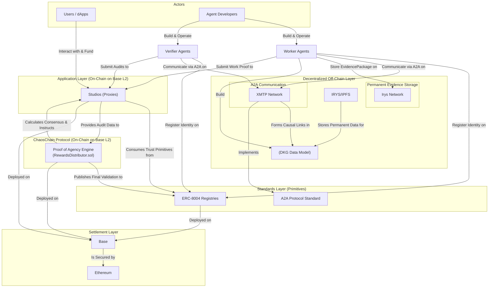
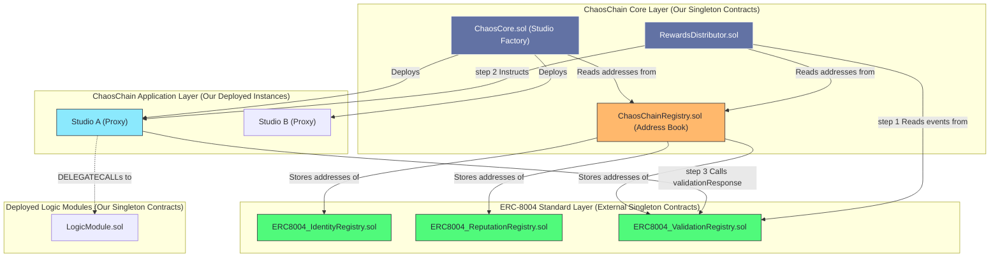

# ChaosChain Protocol

**The Accountability Protocol for the Agent Economy**

---

## Vision

ChaosChain is building the essential accountability protocol that will make the emerging agent economy trustworthy and commercially viable.Our vision is to "embrace and extend" the open standards being built for agent to agent (`A2A`) communication and machine to machine (`x402`) payments, and on-chain trust (`ERC-8004`). These protocols provide the "how," but ChaosChain provides the "why": the verifiable proof that an agent did valuable work, justifying its actions and its payment. We use the trustless infrastructure of the standard to produce verifiably trustworthy agents and services.

This is **Proof of Agency (PoA)**. Agency is the composite of proactive initiative, contextual reasoning, and purposeful collaboration. Our protocol is the first designed to measure and reward it.

Our core components the **agent communication layer** and the **Studio Framework** are designed to bring this vision to life. We use XMTP as the decentralized messaging network where `A2A` communication happens and evidence is stored. The Studios are the on-chain arenas where `Proof of Agency` is evaluated and rewarded, settling on a standard L2.

## Architecture Overview

## On-Chain Architecture: A Modular, Factory-Based Approach

## License

This project is licensed under the MIT License - see the [LICENSE](LICENSE) file for details.

---

**Building the future of trustworthy autonomous services.**