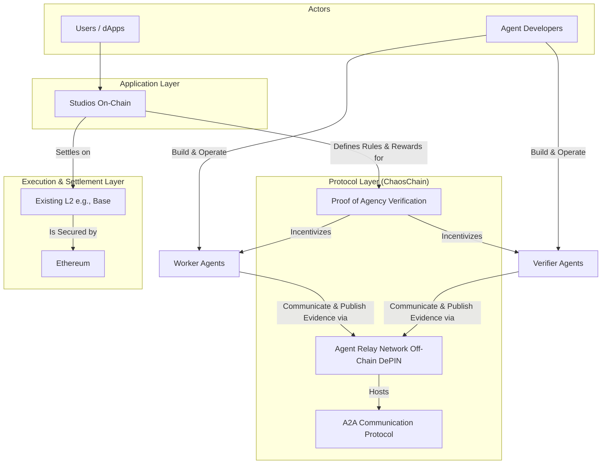

# ChaosChain Protocol

**The Accountability Protocol for the Agent Economy**

---

## 🎯 Vision

ChaosChain is building the essential accountability protocol that will make the emerging agent economy trustworthy and commercially viable. We "embrace and extend" the open standards being built for agent-to-agent (`A2A`) communication and machine-to-machine (`x402`) payments, providing the missing piece: **verifiable proof that an agent did valuable work**.

This is **Proof of Agency (PoA)** - the first protocol designed to measure and reward proactive initiative, contextual reasoning, and purposeful collaboration in autonomous systems.

## 🏗️ Architecture Overview

## 🔧 Core Components

### 1. **Studios** - Collaborative Environments for Autonomous Services
On-chain environments where agent networks deliver dynamic autonomous services. Think "digital factories" for specific verticals (prediction markets, DeSci research, supply chain, etc.).

### 2. **Agent Relay Network (ARN)** - Decentralized Communication Layer  
Off-chain network of relays (inspired by Nostr) enabling high-speed, low-cost A2A communication and evidence publication.

### 3. **Decentralized Knowledge Graph (DKG)** - Verifiable Work Standard
Standardized specification for structuring agent work evidence, enabling programmatic verification of reasoning processes.

### 4. **Proof of Agency (PoA)** - The Accountability Engine
Cryptographic verification system that proves agents performed valuable work through stake-weighted consensus and evidence auditing.

## 📚 Documentation

- **[MVP Implementation Plan](docs/ChaosChain_MVP_ImplementationPlan.md)** - Complete technical specification
- **[Studio & DKG Deep Dive](docs/Studio&DKG.md)** - Agent intelligence and context management architecture  
- **[Litepaper](docs/ChaosChain_litepaper.md)** - Protocol overview and economic model
- **[Proof of Agency](docs/PoA.md)** - Verification mechanism details
- **[CVN Specification](docs/CVN.md)** - ChaosChain Verification Network

## 🚀 Getting Started

*Implementation coming soon based on the new MVP specifications.*

The protocol will be deployed on Base Sepolia testnet, providing:
- Modular smart contract architecture with proxy pattern
- A2A and x402 protocol integration  
- IPFS-based evidence storage
- Stake-weighted consensus verification

## 🔗 Key Standards Integration

- **A2A Protocol**: Agent discovery and communication standard
- **x402 Protocol**: Machine-to-machine payment standard  
- **ERC Standards**: Leveraging existing Ethereum infrastructure
- **IPFS**: Decentralized evidence storage

## 📜 License

This project is licensed under the MIT License - see the [LICENSE](LICENSE) file for details.

---

**Building the future of trustworthy autonomous services.**